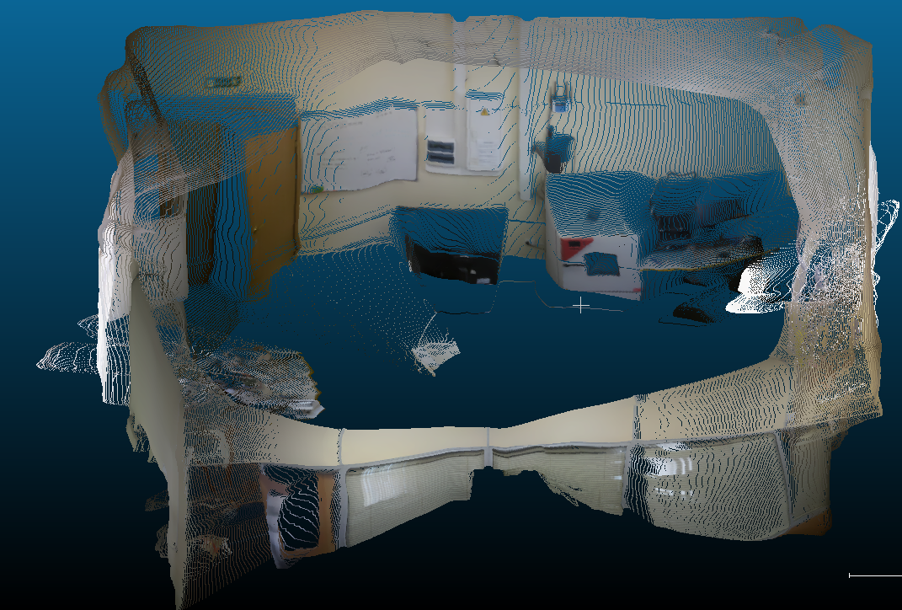

# **3D-scanning system based on monocular vision** <!-- omit in toc -->
## **Table of Contents** <!-- omit in toc -->
- [**Usage**](#usage)
  - [Create panorama image](#1-create-panorama-image)
  - [Build the depth map](#2-build-depth-map)
  - [Calibrate depth map](#3-calibrate-depth-map)
    - [Calibrate depth map with measurement data from Lidar](#31-calibrate-depth-map-with-measurement-data-from-lidar)
    - [Match the edges between the component photos](#32-match-the-edges-between-the-component-photos)
  - [Build point cloud](#4-build-point-cloud)
  - [Visualize the result](#visualize-the-result)
- [**Environment setup**](#environment-setup)

## **Usage**
Scanned images are contained in a folder. Building 3D model from these images is executed by 4 steps:
### 1. Create panorama image
Create the panorama image by using stitch library from OpenCV:
```bash
python match_images.py -f folder_name
```
The panorama image will be created with name `folder_name.png` and saved in the output directory (`output/` by default).

### 2. Build depth map
To predict depth map from images, use trained model `ZoeD-M12-N` from [ZoeDepth repo](https://github.com/isl-org/ZoeDepth).
Divide the panorama image to some smaller images and shift some pixel horizontally, as the dataset image size is 512*384.
```bash
python sanity_panorama.py -f folder_name -s shift_value -d divide_coefficent
```
This will save the depth map as `numpy` file in the folder `output/folder_name/shift/first_depth/`

### 3. Calibrate depth map
#### 3.1 Calibrate depth map with measurement data from Lidar
Firstly use SIFT algorithm to determine the coordinates of the pixels measured by Lidar in the panorama image:
```bash
python search_point_in_panorama.py -f folder_name
```
These coordinates will be saved in csv file `distance.csv` in the folder `27072023-1628` in the output directory.
Then find the dependent function as the first polynomial.
```bash
python solve_param_each_part.py -f folder_name -s shift_value -d divide_coefficent
```
This will save the depth map as numpy file in the folder `output/folder_name/shift/calib_param/`

#### 3.2 Match the edges between the component photos
The depth map of each image is predicted independently, so they will often have a certain difference between the photos at the edges when matching the composition photos together. Therefore it is necessary to apply som calibration to match the adjacent edges.
```bash
python match_difference.py -f folder_name -s shift_value -d divide_coefficent
```
This will save the depth map as numpy file in the folder `output/folder_name/shift/match_diff/`

### 4. Build point cloud
Finnaly, create the point cloud from the depth map:
```bash
python calib_pcd_panorama.py -f folder_name -s shift_value -d divide_coefficent
```
The point cloud will be save as `pcd` file in the folder `output/folder_name/shift/point_cloud/`.

### Visualize the result


## **Environment setup**
The project depends on :
- [pytorch](https://pytorch.org/) (Main framework)
- [timm](https://timm.fast.ai/)  (Backbone helper for MiDaS)
- pillow, matplotlib, scipy, h5py, opencv (utilities)

Install environment using `environment.yml` : 

Using [mamba](https://github.com/mamba-org/mamba) (fastest):
```bash
mamba env create -n zoe --file environment.yml
mamba activate zoe
```
Using conda : 

```bash
conda env create -n zoe --file environment.yml
conda activate zoe
```